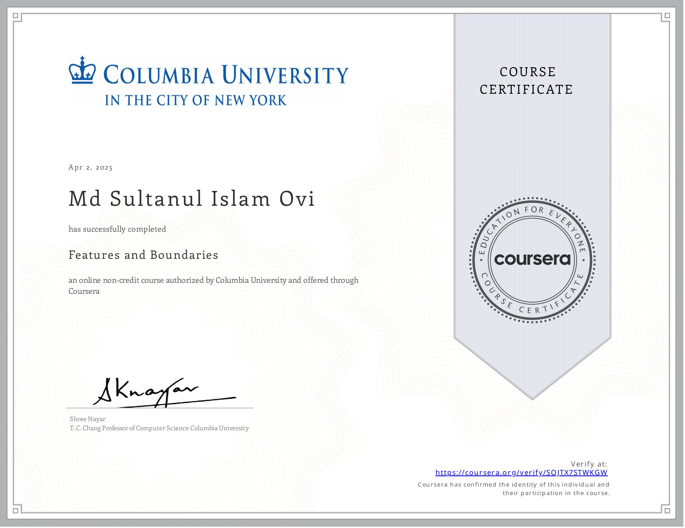

# 🧠 Course 2: Features and Boundaries in Computer Vision

## 📌 Course Outline

### 🏁 Week 1: Introduction

1.1 Overview of Introduction  
1.2 What is Computer Vision?  
1.3 What is Vision Used For?  
1.4 How Do Humans Do It?  
1.5 Topics Covered  
1.6 About the Lecture Series  
1.7 References and Credits

---

### ✂️ Week 2: Edge Detection

2.1 Overview of Edge Detection  
2.2 What is an Edge?  
2.3 Edge Detection Using Gradients  
2.4 Edge Detection Using Laplacian  
2.5 Canny Edge Detector  
2.6 Corner Detection

---

### 🧩 Week 3: Boundary Detection

3.1 Overview of Boundary Detection  
3.2 Fitting Lines and Curves  
3.3 Active Contours  
3.4 Hough Transform  
3.5 Generalized Hough Transform

---

### 🌐 Week 4: SIFT Detector

4.1 Overview of SIFT Detector  
4.2 What is an Interest Point?  
4.3 Detecting Blobs  
4.4 SIFT Detector  
4.5 SIFT Descriptor

---

### 🧷 Week 5: Image Stitching

5.1 Overview of Image Stitching  
5.2 2x2 Image Transformations  
5.3 3x3 Image Transformations  
5.4 Computing Homography  
5.5 Dealing with Outliers: RANSAC  
5.6 Warping and Blending Images

---

### 😊 Week 6: Face Detection

6.1 Overview of Face Detection  
6.2 Uses of Face Detection  
6.3 Haar Features for Face Detection  
6.4 Integral Image  
6.5 Nearest Neighbor Classifier  
6.6 Support Vector Machine

---

## 🧠 What is this course about?

This course teaches how to detect features and boundaries in images—key components for tasks such as object detection, recognition, metrology, and more. From edges and corners to image stitching and face detection, it builds an essential computer vision toolbox.

## 🔍 What are some real-world applications?

- Object detection and recognition
- Scene reconstruction and stitching
- Augmented and virtual reality
- Robotics and autonomous vehicles
- Biometrics and human-computer interaction
- Scientific and medical imaging

## 📥 What background knowledge is necessary?

- Fundamentals of linear algebra and calculus
- Programming knowledge is helpful but **not required**
- No prior experience in imaging or computer vision is assumed

## 🎯 Learning Objectives

- Detect edges, corners, and contours in images
- Apply gradient, Laplacian, and Canny detectors
- Use Hough Transform and active contours
- Detect SIFT interest points and descriptors
- Estimate homographies for image stitching
- Build face detectors using Haar features and SVM

## 📚 Recommended Readings

### 📖 Textbooks

- _Computer Vision: Algorithms and Applications_, Szeliski, R., Springer
- _Computer Vision: A Modern Approach_, Forsyth, D. & Ponce, J., Prentice Hall
- _Robot Vision_, Horn, B.K.P., MIT Press
- _A Guided Tour of Computer Vision_, Nalwa, V., Addison-Wesley
- _Digital Image Processing_, González, R. & Woods, R., Prentice Hall
- _Optics_, Hecht, E., Addison-Wesley
- _Eye and Brain_, Gregory, R., Princeton University Press
- _Animal Eyes_, Land, M. & Nilsson, D., Oxford University Press

### 📄 Research Papers

Each topic is supported by research papers referenced at the **end of the last video** in:

- Edge Detection
- Boundary Detection
- SIFT Detector
- Image Stitching
- Face Detection

---

🚀 _This course strengthens your vision foundation with advanced feature detection techniques essential for solving real-world computer vision problems!_
