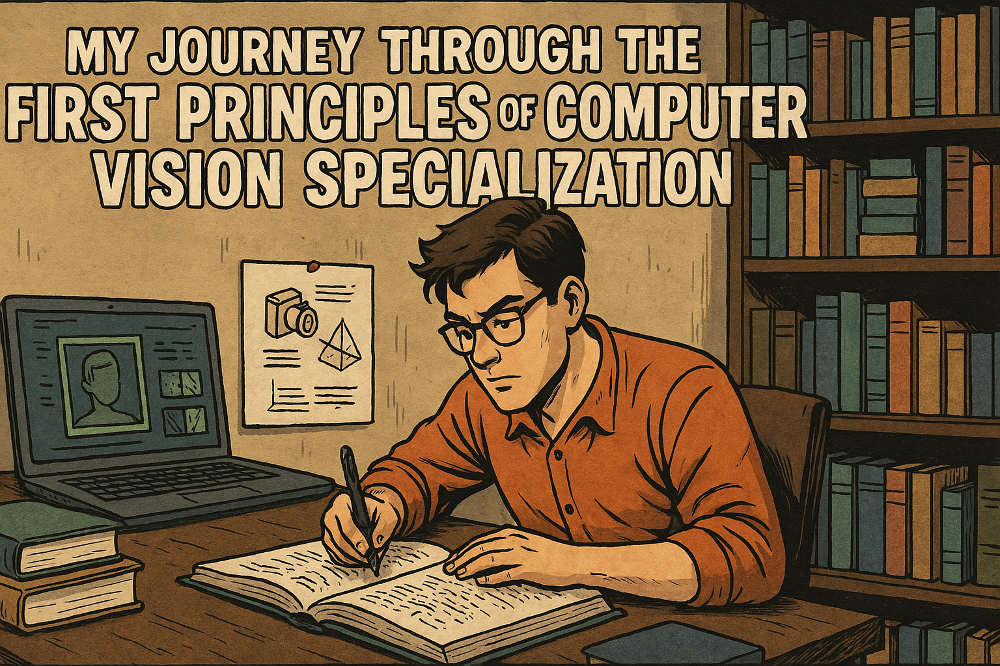
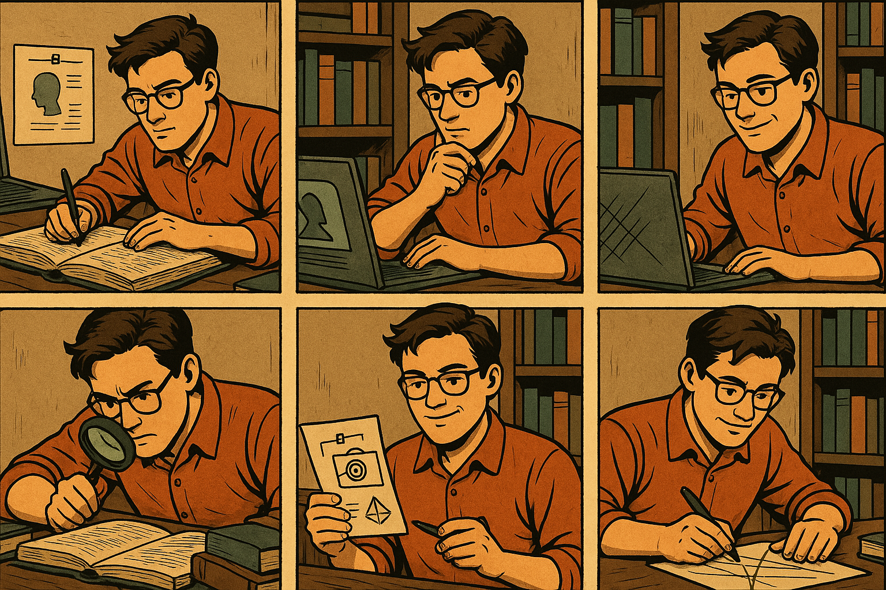

<!--  -->

# Course Link: [First Principles of Computer Vision](https://www.coursera.org/specializations/firstprinciplesofcomputervision)

## 🔍 Why I Took This Specialization

As someone passionate about **AI and computer vision**, I wanted to go beyond just using pre-trained models and actually **understand how vision works**—from the physics of light to the algorithms behind object recognition. This **5-course specialization** took me on a **deep dive** into the **mathematics, physics, and core principles** that form the backbone of modern computer vision.

---

## 🎯 My Biggest Takeaways

✅ **Cameras are more than just sensors** – I learned how images are formed, the physics of light, and how modern image sensors work.  
✅ **Features & edges drive object recognition** – Before AI can "see," it first needs to detect edges, corners, and patterns.  
✅ **Reconstructing 3D from 2D images is mind-blowing** – Understanding **stereo vision, optical flow, and depth estimation** gave me a whole new appreciation for AR/VR and robotics.  
✅ **Tracking objects and recognizing them is an art & science** – Computer vision isn’t just about detecting objects, but also **understanding motion, segmenting images, and recognizing patterns** in a robust way.

---

## 📜 Courses Breakdown

### 📷 Camera and Imaging (6 Modules) | [Coursera](https://www.coursera.org/learn/cameraandimaging?specialization=firstprinciplesofcomputervision) | [Assignments](Course_01_Camera_and_Imaging/readme.md) | [Certificate](Course_01_Camera_and_Imaging/C1_Certificate.jpg)

🔹 How images are formed with **lens cameras**  
🔹 Understanding **CMOS & CCD sensors**, resolution, and dynamic range  
🔹 Exploring **color sensing, HDR imaging, and binary vision**  
🔹 Learning **image filtering techniques** to enhance vision

---

### 🎯 Features and Boundaries (6 Modules) | [Coursera](https://www.coursera.org/learn/features-and-boundaries?specialization=firstprinciplesofcomputervision) | [Assignments](Course_02_Features_and_Boundaries/readme.md) | [Certificate](Course_01_Camera_and_Imaging/C1_Certificate.jpg)

🔹 Detecting edges, corners, and interest points in images  
🔹 Using **SIFT-based feature matching** for panorama stitching  
🔹 Applying **face detection** and object localization

---

### 🏗 3D Reconstruction - Single Viewpoint (6 Modules) | [Coursera](https://www.coursera.org/learn/3d-reconstruction---single-viewpoint?specialization=firstprinciplesofcomputervision) | [Assignments](Course_03_3D_Reconstruction_Single_Viewpoint/readme.md) | [Certificate](Course_01_Camera_and_Imaging/C1_Certificate.jpg)

🔹 Estimating **scene depth and surface orientation**  
🔹 Mastering **Shape from Shading** and **Photometric Stereo**  
🔹 Using **Depth from Defocus** and **Active Illumination** for 3D reconstruction

---

### 🔄 3D Reconstruction - Multiple Viewpoints (5 Modules) | [Coursera](https://www.coursera.org/learn/3d-reconstruction-multiple-viewpoints?specialization=firstprinciplesofcomputervision) | [Assignments](Course_04_3D_Reconstruction_Multiple_Viewpoints/readme.md) | [Certificate](Course_01_Camera_and_Imaging/C1_Certificate.jpg)

🔹 Building **3D structures from multiple images**  
🔹 Understanding **camera calibration and stereo vision**  
🔹 Implementing **optical flow tracking** for motion analysis  
🔹 Exploring **Structure from Motion (SfM)** for real-world applications

---

### 🧠 Visual Perception (5 Modules) | [Coursera](https://www.coursera.org/learn/perception?specialization=firstprinciplesofcomputervision) | [Assignments](Course_05_Visual_Perception/readme.md) | [Certificate](Course_01_Camera_and_Imaging/C1_Certificate.jpg)

🔹 Tracking objects & background subtraction  
🔹 Segmenting images into **meaningful object regions**  
🔹 Understanding **PCA-based recognition and deep learning methods**

---

💡 If you’re serious about **computer vision** and want to build a **strong foundation**, this specialization is an absolute game-changer.
